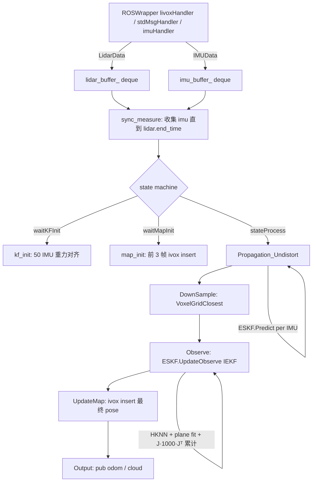

# Round 0 Source Archaeology

Super-LIVO 架构设计前的事实底稿。本报告只陈述源码事实，不做架构决策。

## 0. Repository Versions

| Repository | HEAD | Working tree |
|---|---|---|
| Super-LIO | `60b57aaac8dc397f80c56364e7ccb008c300cc29` (branch `super-livo`) | clean |
| refs/FAST-LIVO2 | `0d2c0346107b75b59934975adec9a6eeeb913c64` | clean |
| refs/open_vins | `69488123ed9362dd44b6f28e7f4680abbff1442b` | clean |

以下所有行号均为上述 HEAD 下的实测。

---

## 1. Super-LIO Runtime Dataflow

### 1.1 主循环

`src/super_lio/src/apps/super_lio_node.cpp:25-30` — 500Hz 循环：`data_wrapper->spinOnce()` → `lio->process()`。
`src/super_lio/include/ros/ROSWrapper.h:57-59` — `spinOnce(){ self_queue_.callAvailable(); }`（自定义回调队列）。

### 1.2 订阅与缓冲

`src/super_lio/src/ros/ROSWrapper.cpp:187-217` — 订阅 `subLidar_`（Livox CustomMsg 或 PointCloud2，队列 1000）与 `subIMU_`（队列 10000）。
- `livoxHandler`（ROSWrapper.cpp:220-242）：tag 过滤 `(tag & 0x30)==0x10||0x00`、距离过滤 `g_blind2/g_maxrange2`、按 `g_filter_rate` 抽稀；产出 `LidarData{start_time,end_time,pc<PointXTZIT>}`（每点带 `offset_time`），压入 `lidar_buffer_`（:241）。
- `stdMsgHandler`（:254-339）：HESAI16/VEL_NCLT/VELO16/VELO32/OUSTER 分支，产出同样的 `LidarData`（:338）。
- `imuHandler`（:343-415）：时间回退检测（:353-360），压入 `imu_buffer_`（:362）；并调用 `eskf_->Predict(data, imu_state, robo_state)`（:369）发布 IMU 频率 odom。
- 缓冲容器：`ROSWrapper.h:103-104` — `std::deque<IMUData> imu_buffer_; std::deque<LidarData> lidar_buffer_;`。

**重要**：`src/basic/include/basic/buffer/{LatestOnlyBuffer,RingBuffer,MultiSourceLatestBuffer}.hpp` 三个模板类全仓库无实例化 —— 主流水线不使用它们（死代码）。

### 1.3 同步

`ROSWrapper.cpp:418-454` `sync_measure` — 要求 `last_timestamp_imu_ >= meas.lidar.end_time`（:436-438）；把 `secs < lidar.end_time` 的 IMU 拷入 `meas.imu` 并 pop（:441-448）；pop lidar（:451）。
`src/super_lio/src/lio/super_lio.cpp:107-112` `process` — `sync_measure` 失败直接返回；成功则执行状态机 `(this->*state_fn_)()`。

### 1.4 状态机

- `stateWaitKFInit`（super_lio.cpp:90-96）→ `kf_init`（:115-160）：50 个 IMU 测重力对齐，`SetInitialConditions(options, mean_gyro, V3::Zero(), imu_scale, ref_gravity)`（:152），`SetX`（:157）。
- `stateWaitMapInit`（:98-105）→ `map_init`（:163-190）：前 3 帧 `ivox_->insert(points_world_v3_)`（:182），`frame_num_>3` 后进入 `stateProcess`。
- `stateProcess`（:193-208）：4 步管线 `Propagation_Undistort → DownSample → Observe → UpdateMap`，随后 `Output()`（:206）、`caceData()`（:207）。

### 1.5 IMU propagation + LiDAR undistortion（内联在 Propagation_Undistort）

`super_lio.cpp:351-416` `Propagation_Undistort`：
- :352-358 记录每次 `kf_->Predict(imu)` 前后的 `propagate_states_`；:354 先 `kf_->SetObsTime(measures_.lidar.end_time)`。
- :371-415 `tbb::parallel_for` 对每个 raw 点，在 `propagate_states_` 中线性查区间（:389-395）；`R_i = Quat(R_h).slerp(s, Quat(R_t))`（:406）、`p_i = p_h + v_h·τ + ½·a·τ²`（:407）；最终 `eigen_point = R_inv * (R_i*(TLI_R*raw+TLI_t) + (p_i − T_end_t))`（:410）—— 去畸变到 **scan 末时刻**。
- `ESKF::Predict`（`src/super_lio/src/lio/ESKF.cpp:187-247`）：离散 ESKF 传播，`F_X/F_W` Jacobian（:222-235），`P_ = f_x·P_·f_xᵀ + f_w·Q_·f_wᵀ`（:237），中点积分（:213-216）。

### 1.6 Downsample

`super_lio.cpp:419-422` `DownSample` → `VoxelGridClosest<PointType>`（自定义，非 PCL）`src/super_lio/include/OctVoxMap/VoxelGridFilter.h:47-79` —— 取整到体素中心，每体素保留距中心最近的点（:68-71）；产物 `ds_undistort_`。

### 1.7 Observe（IEKF）

`super_lio.cpp:432-527` `Observe` — 调用 `kf_->UpdateObserve(lambda)`（:451）。详见第 3 节。`iter_num`（:449,523）与 `H_R_`（super_lio.h:79）为死代码。

### 1.8 地图更新

`super_lio.cpp:530-547` `UpdateMap` — 用最终 pose `kf_->GetSE3()`（:534）变换 `points_body_v3_` → `points_world_v3_`（:540-543），`ivox_->insert(points_world_v3_)`（:545）。

### 1.9 输出

`super_lio.cpp:550-575` `Output` → `data_wrapper_->pub_odom(state)`（:552；实现 `ROSWrapper.cpp:457-541`）；可视云按 `g_pub_step` 抽帧、`g_visual_dense` 选全量或降采样（:560-574）。
`caceData`（:211-254）：`g_save_map` 时累计 `point_map_` 并周期存 PCD。

### 1.10 Mermaid flowchart



---

## 2. Super-LIO ESKF Semantics

### 2.1 状态定义

`src/super_lio/include/lio/ESKF.h:101-106`：

```cpp
BASIC::SO3 R_;  BASIC::V3 p_, v_, bg_, ba_;  BASIC::V3 g_{0,0,-g_gravity_norm};
```

顺序：**R, p, v, bg, ba, g**（六者全在）。`STATE = Eigen::Matrix<scalar,18,1>`，注释索引 R(0) p(3) v(6) bg(9) ba(12) g(15)（ESKF.h:15-17）。
- error state `dx_`：18×1（ESKF.h:110）；covariance `P_`：18×18（ESKF.h:112, :19）；noise `Q_`：12×12（ESKF.h:114；`BuildNoise` ESKF.cpp:100-116）。
- **pose 6DoF 索引**：R→块 0-2，p→块 3-5（ESKF.cpp:119-121；UpdateObserve 中 `HTRH.block<6,6>(0,0)` 与 `b.head<6>()` 同索引，ESKF.cpp:298-306）。
- propagation：`Predict`（ESKF.cpp:187-247）。初值 `P_=1e-4·I`，R 块 `0.1·π/180·I`（:80-82）。
- update 更新**全部 18 维**：`R_ = R_·Exp(dx[0:3])`（右扰动，:119），p/v/bg/ba += dx（:120-124），g_ += dx[15:18] 后归一化到 g_gravity_norm（:126-127）。
- **死代码**：`STATE_DOF`（17 维，ESKF.h:17）与 `S2` 流形（Manifold.h:213-239）声明但从未被 ESKF 使用 —— g 按 3 维自由向量处理。

### 2.2 UpdateObserve 完整语义

观察回调 typedef（ESKF.h:57）：

```cpp
using ObsFunc = std::function<void(const KFState&, BASIC::M6& HT_Vinv_H, BASIC::V6& HT_Vinv_r)>;
```

`KFState = {bool need_converge; SE3 pose;}`（ESKF.h:36-39）。

- IEKF 迭代循环：`ESKF.cpp:271-318`，上限 `options_.num_iterations_`（ESKF.h:26，默认 3；运行时 `g_kf_max_iterations` 覆盖，默认 4，params.cpp:51）。
- **prior 固定**：`R_pred..g_pred, P_pred` 循环外一次性捕获（ESKF.cpp:253-260）。
- **current state 每轮变化**：每轮末尾 `Update()`（:313）应用 `dx_`，下一轮 `obs(GetKFState(),...)`（:276）拿到新 pose。
- **covariance 循环内不更新**：每轮只用固定 `P_pred` 计算 `Pk`（:293）；`P_` 仅在循环外赋值一次（:320）+ 复位变换（:322-328）+ 对称化（:330）。
- **need_converge**：:269 置 false；`iter > 2` 时置 true（:272-274）——默认 4 轮时仅最后一轮（iter 3）为 converge 轮。
- **收敛判断**：`if (dx_.lpNorm<Infinity>() < options_.quit_eps_ && iter > 0) break;`（:315-317，`quit_eps_=1e-6`）。
- **6×6 info block 嵌入**：`HTRH.block<6,6>(0,0)=HTVH`、`b.head<6>()=HTVr`，其余 0（:298-306）。

伪代码（每行对应源码）：

```text
R_pred,p_pred,v_pred,bg_pred,ba_pred,g_pred ← (R_,p_,v_,bg_,ba_,g_)     // 253-258 固定 prior
P_pred ← P_                                                              // 260
need_converge_ ← false                                                    // 269
for iter in 0 .. num_iterations_-1:                                       // 271
    if iter > 2: need_converge_ ← true                                    // 272-274
    obs(GetKFState(), HTVH, HTVr)          // 填 6x6/6x1，见第 3 节          // 276
    dx_prior ← [log(R_pred⁻¹·R_), p−p_pred, v−v_pred, bg−bg_pred, ba−ba_pred, g−g_pred]  // 278-284
    G_prior[0:3,0:3] ← I − ½·hat(dx_prior[0:3])                           // 286-291
    Pk ← G_prior·P_pred·G_priorᵀ                                          // 293
    dx_prior ← G_prior·dx_prior                                           // 295
    HTRH ← 0; HTRH[0:6,0:6] ← HTVH                                       // 298-299
    Qk ← (Pk⁻¹ + HTRH)⁻¹                                                  // 302-303
    b ← 0; b[0:6] ← HTVr                                                  // 305-306
    K_x ← Qk·HTRH                                                          // 308
    dx_ ← Qk·b + (K_x − I)·dx_prior          // 信息形式 ESIKF 解           // 311
    Update()                                 // R←R·Exp(dx[0:3]); p,v,bg,ba,g += dx; g 归一化  // 313
    if ‖dx_‖∞ < quit_eps_ and iter > 0: break                             // 315-317
P_ ← Qk                                                                    // 320
G_reset[0:3,0:3] ← I − ½·hat(dx_[0:3]); P_ ← G_reset·P_·G_resetᵀ          // 322-328
P_ ← ½(P_+P_ᵀ); dx_.setZero()                                             // 330, 332
```

**Gate R0-2 直接回答**：
- prior state = 循环外捕获的 propagation 后状态（253-260）
- current iteration state = 每轮 Update() 后的 `R_,p_,...`（GetKFState 实时打包，:276）
- H/J = 每轮在 observation callback 内用 current pose 计算（见第 3 节）
- P 在**循环外**更新一次（:320），循环内 P 不变

---

## 3. Super-LIO LiDAR Observation and Cached Correspondence

### 3.1 residual 与 plane fitting

- `super_lio.cpp:56-62` `compute_error`：`error = abcd[0]·p.x + abcd[1]·p.y + abcd[2]·p.z + abcd[3]`（:60）；距离门控 `length > 81·error²`（:61，length=‖p_body‖，:445）。
- `super_lio.cpp:15-53` `calc_plane_coeff`：对 top-K 邻居（4 或 5 个）解 `A·n = −1`（QR colPivHouseholderQr，:25/:35）；`abcd[3]=1/‖n‖`、n 归一化（:41-45）；任一点残差 >0.1 拒绝（:47-51）。

### 3.2 Jacobian 与直接累计

- world 点转换：`pose = kf_state.pose`（=当前迭代 nominal SE3，:452）、`point_world = pose * point_body`（:466）。
- normal 来源：OctVox 中存储的邻居**质心点**（OctVoxMap.hpp:113 运行平均），`ivox_->getTopK(point_world, top_K)`（:470）→ HKNN。
- J_L 构造（:487-493）：`nb = Rᵀ·n`（R=当前 pose 旋转，:454）；`J.head<3>() = point_body × nb`（旋转，body 系）、`J.tail<3>() = normvec`（平移，world 系 n）。
- **直接累计**（:495-496，权重 1000）：

```cpp
local_acc.HTVH += J * 1000 * J.transpose();   // Σ J Jᵀ
local_acc.HTVr -= J * 1000 * error;           // Σ J r
```

- **TBB accumulation**（:456-508）：`tbb::enumerable_thread_specific<ThreadACC>`（:456）→ `tbb::parallel_for(blocked_range(0, effect_knn_num_))`（:458-459）→ 每线程 `tls_acc.local()`（:462）→ 串行归约（:501-506）→ `.cast<scalar>()` 转 float `M6/V6`（:507-508）。
- accumulator 类型（:425-429）：`ThreadACC { M6d HTVH; V6d HTVr; }` = `Eigen::Matrix<double,6,6>` / `Eigen::Matrix<double,6,1>`（alias.h:260/:238）。**不存在 N×6 dense H**。
- 每轮重做 HKNN+plane fit？：`!need_converge` 轮次（默认 iter 0,1,2）**重做**（:468-478）；converge 轮（iter 3）跳过（:510 `if(need_converge) return;`）。
- correspondence 缓存：**不跨轮缓存** —— 每非收敛轮重做；仅收敛轮复用上一轮留下的成员。

### 3.3 三个成员的作用

- `effect_knn_idxs_`（super_lio.h:78）：帧首 iota 全量（:440），每非收敛轮末压缩为幸存点索引（:512-521）。
- `abcd_vec_`（super_lio.h:80）：`std::vector<std::array<double,4>>`，每点平面 (nx,ny,nz,d)（:477）。
- `effect_mask_`（super_lio.h:76，`alignas(64) bool[20000]`）：每点最终有效性 —— HKNN<4 置 false（:472）、plane fit 失败置 false（:477）、距离门控重写（:484）。`effect_knn_mask_`（:77）是 HKNN+plane 的中间掩码，仅用于压缩。

**死代码**：`g_residual_type`（params.cpp:71 = PROB）定义后无任何读取 —— 不存在概率/混合残差路径，实际只有 point-to-plane。

### 3.4 Common-FEJ 可复用性分析（A5）

**结论：PASS —— 现有缓存足够安全做到"最后一轮后不再执行 HKNN/plane fit，只重算 r_L(x_F)/J_L(x_F)"。**

UpdateObserve 返回后的成员状态：
- `effect_knn_idxs_[0..effect_knn_num_)`：收敛轮 :510 return 使点集保持上一非收敛轮压缩结果。
- `abcd_vec_[idx]`：收敛轮不重写（:468-478 门控），保留迭代 n−1 轮的 (n,d)。
- `effect_mask_[idx]`：收敛轮 :484 仍重写（最终有效性掩码）。
- `points_body_v3_[idx]`：成员（super_lio.h:75），帧内不变。
- pose：`kf_->GetSE3()`（UpdateMap :534 同源读取）。

| 所需量 | 来源 | 状态 |
|---|---|---|
| 点集（body 系） | `points_body_v3_[idx]` | ✓ 成员 |
| 每点 plane (n,d) | `abcd_vec_[idx]` | ✓ 成员 |
| 每点有效性 | `effect_mask_[idx]` | ✓ 成员 |
| pose | `kf_->GetSE3()` | ✓ 可读 |
| r_L = n·(pose·p_b)+d | 上述 | ✓ 可重算 |
| J_L = [p_b×(Rᵀn); n] | 上述（与 pose 无关） | ✓ 可重算 |

实现注意（不改变 PASS）：
1. 复用必须**再按 `effect_mask_` 过滤**（收敛轮会置 false）。
2. `_lengths` 是 `Observe` 内 static（:435,445），非成员 —— 但它只用于距离门控，不参与 r/J。
3. HKNN 的 5 个邻居原始点不保留（只留 abcd）——"重做 plane fit 而不重做 HKNN"不可能，但 Common-FEJ 不需要。
4. 帧首 iota（:440）覆盖 `effect_knn_idxs_` —— 缓存只在**同一帧** UpdateObserve 结束后有效；跨帧需自行保存。

---

## 4. OctVox Data Structure and Memory

### 4.1 事实结构

- KEY：`Eigen::Vector3i`（`OctVoxMap.hpp:137`），sizeof=12。
- hash map：`tsl::robin_map<KEY, DATA_ITER, HASH_VEC>`（:256），私有嵌套 `HASH_VEC`（:243-250，HashShiftMix 风格），`KeyEqual=std::equal_to`，StoreHash=false，power_of_two_growth_policy<2>。
- LRU list：`DATA_LIST = std::list<std::pair<KEY, OctVoxType>>`（:252-253），front=MRU、back=LRU。**不是 access-LRU** —— 只有 `insert()` 触碰（:300 splice），`getTopK` 是 const 不更新次序。
- voxel object：`OctVox<Point>`（:89-129），字段 `counts_ std::array<uint8_t,8>` + `points_ std::array<Point,8>`。
- subvoxel 表示：`local_idx = (dz<<2)|(dy<<1)|dx`（:285），细 key=`floor(p·sub_inv_res)`，粗 key=`fine>>1`，sub_resolution=resolution/2（:185）。
- representative point：`Point = Eigen::Matrix<float,3,1>`（实例化于 super_lio.h:55，alias.h:143/:147），存**增量均值**（AddPoint :113）而非原始点。
- counter：每 subvoxel `uint8_t`，0x00=未初始化，饱和上限 20（:123-124）。
- capacity：地图级默认 1e6（:144），运行时默认 `g_ivox_capacity=100000`（params.cpp:46），ROS 参数 `/lio/hash_map/hash_capacity`（ROSWrapper.cpp:74-76）。
- eviction（:287-297）：**仅新建 voxel 且 `data_.size()>=capacity_`** 时，先 `grids_.erase(data_.back().first)`（:295）再 `data_.pop_back()`（:296）；已存在 key 分支不淘汰。
- insert/update（:265-303）：新增 `emplace_front`+`grids_.insert`（:289-292）；已存在 `AddPoint`+splice 到 front（:299-300）。
- AddPoint（:101-115）：首点直存；`count>=MAX_POINTS_PER_SUBVOXEL(20)` 饱和丢弃；距均值 >0.1m 丢弃（DISTANCE_THRESHOLD_SQ=0.01）；否则运行均值 `(stored*count+pt)/(count+1)`。
- **merge threshold：不存在**。无 voxel 合并/decay/weight 逻辑。

字段树（真实字段名）：

```text
OctVoxMap<Point=Eigen::Matrix<float,3,1>, Scalar=float>   // :134
├── float resolution_ / inv_resolution_ / sub_resolution_ / sub_inv_resolution_  // 222-225
├── size_t capacity_ = 1000000                            // 226
├── bool reset_map_; int reset_map_count_                  // 228-229
├── const KEY nearby_grids_[19]                            // 231-240
├── DATA_LIST data_ : std::list<std::pair<KEY, OctVox<Point>>>  // 252,255
├── tsl::robin_map<KEY, DATA_ITER, HASH_VEC> grids_       // 256
├── std::vector<uint8_t*> flat_search_ptrs_               // 258
└── int group_idx_max_                                     // 259

OctVox<Point>                                             // 89-129
├── std::array<uint8_t, 8> counts_                        // 127
├── std::array<Point, 8>    points_                       // 128
└── UNINIT_MASK=0x00, MAX_POINTS_PER_SUBVOXEL=20, DISTANCE_THRESHOLD_SQ=0.01  // 123-125
```

### 4.2 实际 sizeof（g++ 9.4.0, x86-64, 实测 /tmp 探针）

| 类型 | sizeof | 说明 |
|---|---|---|
| KEY (Eigen::Vector3i) | 12 | |
| Point (Matrix\<float,3,1\>) | 12 | |
| OctVox\<Point\> | 104 | = points_(96)+counts_(8)，无尾填充 |
| std::pair\<KEY, OctVox\> | 116 | |
| std::list 节点（libstdc++ `_List_node`） | 136 | 工具链特定 |
| tsl::robin_map 对象本身 | 80 | |
| OctVoxMap 整个对象 | 400 | |
| KNNHeap\<5,Point\> | 88 | HKNN 栈对象 |

每 voxel 稳态开销 ≈ **136 B（list 节点）+ 24 B（bucket 项，推算）≈ 160 B/voxel** + map 对象 80 B。

**不可直接测量**：
- robin_map bucket 项内部布局（`detail_robin_hash` 私有类型）：StoreHash=false → entry=pair\<KEY,DATA_ITER\>=20B，对齐到 8=24B（**推算**）。
- std::list 节点 136B 为 libstdc++ 内部类型直接 sizeof，不可移植。

编译前提记录：OctVoxMap.hpp 独立编译需先 include `<pcl/point_cloud.h>`+`<pcl/io/pcd_io.h>`（saveMap 函数体在隐式实例化时被实例化）、`-DROOT=` 宏、`-lpcl_io -lpcl_common -ltbb`。

### 4.3 LRU hook 可扩展性候选（不选型）

淘汰唯一位置 `OctVoxMap.hpp:294-297`，insert 是唯一变更路径。候选：

| 方案 | 修改文件 | API 侵入 | overhead | ownership 风险 |
|---|---|---|---|---|
| A. out-param 淘汰 key 列表（`insert(..., std::vector<KEY>* evicted=nullptr)`） | OctVoxMap.hpp :189/:265/:294 + 4 调用点 | 低（默认参数） | 每次淘汰 1 次 12B 拷贝，近零 | 低；须 drain 向量 |
| B. `std::function<void(const KEY&)>` 回调成员 | 仅 OctVoxMap.hpp | 低（纯增量） | 间接调用 + 可能堆分配 | 中：回调内禁止重入 insert/clear |
| C. 改 insert 返回类型 | OctVoxMap.hpp + 4 调用点 | 高（破坏性） | 同 A | 同 A |
| D. 子类重写 insert | 新文件 | 不可行：insert 非 virtual、成员 private | — | 逻辑复制会漂移 |
| E. 外层 wrapper 自跟踪 | 新文件 | 对 OctVoxMap 零侵入 | 每帧 O(N) diff | 双份状态漂移 |
| F. 迭代器包装/观察 robin_map | — | 不推荐 | — | insert/erase 使迭代器失效 |

注意事项：`resetMap()` 走 `clear()`+`insert()`（:433-451）不经淘汰路径，visual 侧同步清空需覆盖 `clear()`（:500-503）；淘汰在新元素插入**之后**触发；LRU 非永久删除（被淘汰 voxel 下帧可重新进入）。

---

## 5. FAST-LIVO2 Time Synchronization and Sequential Update

### 5.1 三个 callback 与 offset

| Sensor | Callback | 位置 |
|---|---|---|
| LiDAR (AVIA) | `livox_pcl_cbk` | src/LIVMapper.cpp:726（订阅 :194-195） |
| LiDAR (其他) | `standard_pcl_cbk` | :703（订阅 :195-196） |
| IMU | `imu_cbk` | :769（订阅 :197） |
| Image | `img_cbk` | :829（订阅 :198） |

- imu_time_offset：`:776` `msg->header.stamp.toSec() - imu_time_offset`（ros_driver_fix_en 时整秒对齐，:784）。
- lidar_time_offset：`:708` `cur_head_time = msg->header.stamp.toSec() + lidar_time_offset` —— **只在 standard_pcl_cbk 施加**；livox_pcl_cbk 直接 `msg->header.stamp.toSec()`（:744）。
- img_time_offset：`:847` `msg_header_time = msg->header.stamp.toSec() + img_time_offset`。
- exposure_time_init：`:72` 读参数，加在 image time 上（:953、:1047）。
- **image timestamp = msg.header.stamp + img_time_offset + exposure_time_init**。`exposure_time_init` 是静态校准常数；在线估计的 `inv_expo_time` 是光度增益（vio.cpp:1621），两者不同。
- 过滤：hilti_en 40→10Hz 抽样（:841-845）；重复帧 |dt|<0.001 丢弃（:848）；回退丢弃（:852-856）；>0.02 跳变丢弃（:862-868）。

### 5.2 LiDAR scan 按 image timestamp 切分（sync_packages LIVO 分支）

`sync_packages` 定义 :884。LIVO 模式 case LIVO :940，切分核心 :1001-1033：

```cpp
if (pcl[i].curvature < max_offs_time_ms) {        // 点时间 < img_capture_time
    pt.curvature += (frame_header_time - meas.last_lio_update_time) * 1000.0f;
    meas.pcl_proc_cur->points.push_back(pt);       // 本次 LIO 处理
} else {
    pt.curvature += (frame_header_time - m.lio_time) * 1000.0f;
    meas.pcl_proc_next->points.push_back(pt);      // 留到下一次
}
```

- `pcl_proc_cur` 先承接上一轮留下的 `pcl_proc_next`（:1001-1002），再叠加新帧中 `时间 < img_capture_time` 的点。
- 点相对时间存在 `curvature`（ms）：`preprocess.cpp:176` `curvature = offset_time/1e6`（offset_time 为 ns）。
- 重新定基使 `curvature/1000`（s）相对 `last_lio_update_time`，与 IMU pose 的 `offset_time`（相对 `prop_beg_time`）对齐（IMU_Processing.cpp:514-516）。

### 5.3 LIO time vs VIO time

| 量 | 定义 | 证据 |
|---|---|---|
| `meas.last_lio_update_time` | 上一次状态更新时刻（=传播终点） | IMU_Processing.cpp:435 |
| LIO time（LIVO 模式） | `m.lio_time = img_capture_time`（=图像曝光时刻） | LIVMapper.cpp:986 |
| VIO time（LIVO 模式） | `m.vio_time = img_capture_time`；`m.lio_time = meas.last_lio_update_time` | :1054-1055 |
| IMU 传播终点 | `prop_end_time = (flg==LIO) ? meas.lio_time : meas.vio_time` | IMU_Processing.cpp:253 |

设计意图注释：LIVMapper.cpp:942-943 `/* For LIVO mode, the time of LIO update is set to be the same as VIO, LIO first than VIO imediatly */`。

### 5.4 真实时间轴（LIVO 模式）

```text
  t_prev = T_img_{i-1}          t_i = T_img_i                  t_{i+1}
  (上次 LIO+VIO 时刻)          (img_i 曝光时刻)
        │                          │
 LiDAR: │ [scan...][─── scan 帧 ───]
        │  点时间 = header + curvature(ms)
        │                          │◄─ sync_packages 切分点: 点时间 < t_i 进 pcl_proc_cur
 IMU:   │ ────────────────────────► IMU 传播段 (last_lio_update_time, t_i]
 loop k (WAIT→LIO):                │ LIO IEKF @ t_i（state_=传播后, prior=state_propagat=传播后）
 loop k+1 (LIO→VIO):               │ VIO IEKF @ t_i ← 同一时刻，无 IMU 传播
                                    │      └─ prior = LIO 后验 @ t_i
        │                          │                              │◄─ 下一轮 LIO @ t_{i+1}
        │                          │                     IMU 传播段 (t_i, t_{i+1}]
```

### 5.5 LIO→VIO 顺序证明

```
main()                                       src/main.cpp:8-10
└─ mapper.run()                              LIVMapper.cpp:540
   └─ sync_packages(LidarMeasures)           :540
   ├─ handleFirstFrame()                     :545
   ├─ processImu()                           :547
   │  └─ p_imu->Process2(...)                LIVMapper.cpp:252 → IMU_Processing.cpp:543
   │     └─ UndistortPcl(...)                IMU_Processing.cpp:586 → 237
   │  ├─ state_propagat = _state;            LIVMapper.cpp:256   ← 固定 prior
   │  └─ voxelmap_manager->state_ = _state;  :257   ← IEKF 初值
   └─ stateEstimationAndMapping()            :551 → 267
      └─ switch (lio_vio_flg)                :269
         ├─ VIO:  handleVIO()                :272 → 281
         └─ LIO/LO: handleLIO()              :275 → 336
```

handleLIO（:336-424）：downsample → transformLidar(_state) → `StateEstimation(state_propagat)`（:370）→ `_state = voxelmap_manager->state_`（:371）→ UpdateVoxelMap。
handleVIO（:281-305）：`vio_manager->processFrame(meas.img, _pv_list, voxel_map_, last_lio_update_time - first)`（:305）。

四个关键答案：
1. **VIO prior mean** = `*vio_manager->state_propagat`（指针绑定 LIVMapper::state_propagat，:136），而 state_propagat = LIO 后的 `_state` 快照（:256）。VIO IEKF 中 `vec = (*state_propagat) - (*state)`（vio.cpp:1499, :1664）。
2. **VIO prior covariance** = `state->cov`（vio_manager->state 绑定 `_state`，:135）；`K_1 = (H_T_H + (state->cov / img_point_cov).inverse()).inverse()`（vio.cpp:1497, :1661）；`_state.cov` 是 LIO 后验（voxel_map.cpp:489-490 `state_.cov = (I-G)*state_.cov`）。
3. **同一 timestamp**：LIO `m.lio_time = img_capture_time`（:986）；VIO `m.vio_time = img_capture_time` 且 `m.lio_time = meas.last_lio_update_time`（:1054-1055）。
4. **LIO 与 VIO 之间无 IMU propagation**：VIO 步骤 IMU 收集循环被注释（:1050-1071）；UndistortPcl 中 `v_imu` size==1，传播循环不执行（IMU_Processing.cpp:245, :327）；唯一传播在 LIO 步骤（IMU_Processing.cpp:253）。

### 5.6 LIO 线性化点（voxel_map.cpp）

`StateEstimation(StatesGroup &state_propagat)`（voxel_map.cpp:338）。`state_` = 类成员 IEKF 当前迭代状态（初值=传播后，LIVMapper.cpp:257）；`state_propagat` = 函数参数，固定 prior，全程不变。

| Quantity | current state (`state_`) | fixed prior (`state_propagat`) | other |
|---|---|---|---|
| point transform | ✅ `TransformLidar(state_.rot_end, state_.pos_end, ...)` :376 | — | 外参 extR_/extT_ 固定 :522 |
| correspondence | ✅ `pv.point_w`（当前变换）:383, :720 | — | 平面/法线来自已建 map（固定） |
| residual | ✅ `dis_to_plane_`（当前 p_w）:753, :457 | — | 平面 normal_/d_/center_ 固定 |
| Jacobian H | ✅ `state_.rot_end.transpose()` :453-454 | — | point_crossmat body 系常数 :421 |
| measurement noise R_inv | — | ✅ `state_propagat.rot_end/pos_end` :425, :445 | plane_var_ 地图 :447 |
| prior difference | ✅ 被减数 :470 | ✅ 减数 :470 | — |

**H 与 residual 用当前迭代状态；R_inv 与 IEKF prior 项用固定 state_propagat；对应关系每轮重找（rematch，:482）。** VIO 侧结构相同（vio.cpp:1664-1667）。

---

## 6. FAST-LIVO2 Visual Map and VisualPoint Lifecycle

无 `VisualSubmap` 类 —— 对应物是 `SubSparseMap`（每帧重建的活动子图，vio.h:26-57）。

### 6.1 VisualPoint / Feature / Frame 字段

**VisualPoint**（visual_point.h:28-37）：

| 分类 | 字段 | 类型 |
|---|---|---|
| Geometry | `pos_` | Vector3d |
| Geometry | `normal_` / `previous_normal_` | Vector3d |
| Geometry | `normal_information_`（**声明但从未写入**，死字段 72B） | Matrix3d |
| Geometry | `covariance_`（拷贝 LiDAR `pt_var.var`，vio.cpp:886） | Matrix3d |
| Reference photometric | `ref_patch`（Feature*）+ `has_ref_patch_` | Feature* + bool |
| State/history | `obs_`（观察该点的 Feature 链表） | std::list\<Feature*\> |
| State/history | `is_converged_` / `is_normal_initialized_` | bool |

**Feature**（feature.h:19-54）：`f_`（单位向量）、`T_f_w_`（SE3）、`img_`（cv::Mat 浅拷贝）、`px_`、`level_`、`patch_`（**heap** `new float[patch_size_total]`）、`point_`（所属 VisualPoint*）、`id_`（=frame id）、`score_`、`mean_`、`inv_expo_time_`、`type_`（CORNER/EDGELET，恒 CORNER）、`grad_`（实际不用）。

**Frame**（frame.h:31-37）：`frame_counter_`(static)、`id_`、`cam_`、`T_f_w_`、`T_f_w_prior_`、`img_`(cv::Mat)、`fts_`(`list<Feature*>`)。**`fts_` 从未被填充**；`createImgPyramid` 定义（frame.cpp:54-63）但**从未被调用** —— 无真实图像金字塔。

**Heavy ownership 清单**（未来决定哪些不能搬进 Super-LIO 的关键）：
- `Feature::patch_`：heap 数组（64 float = 256B），每个 Feature 一份。
- `Feature::img_`：cv::Mat 引用计数 → **旧帧整图数据滞留**（obs 上限 30 份/点，vio.cpp:947）。
- `VisualPoint::obs_`：std::list\<Feature*\> 链表。
- `Frame::img_`：整帧灰度图（每帧 clone/cvtColor 拷贝，vio.cpp:1793-1797）。
- `SubSparseMap::warp_patch`：每帧 total_points×64×levels 个 float。

### 6.2 VisualPoint 创建过程

调用链：LIVMapper.cpp:305 → vio.cpp:1786 `processFrame` → :1814 `generateVisualMapPoints`：
1. map point：`pg`（_pv_list）来自 LiDAR（LIVMapper.cpp:372/:426 = voxelmap_manager->pv_list_；:417-422 填 point_w/var）。
2. normal：来自 voxel map 平面拟合（voxel_map.cpp:744 `pv.normal = plane.normal_`）。
3. camera projection：`V2D pc(new_frame_->w2c(pt))` + `isInFrame(..., border)`（vio.cpp:814-816）。
4. image grid：`index = int(pc[1]/grid_size)*grid_n_width + int(pc[0]/grid_size)`（:818）。
5. score：`vk::shiTomasiScore(img, pc[0], pc[1])` 与 grid cell 现有值竞争（:822-829）；raycast 的 LiDAR 平面中心同规则竞争（:834-854）。
6. VisualPoint：`new VisualPoint(pt)`（:877）→ `new Feature(pt_new, patch, pc, f, T_f_w_, 0)`（:880，patch 来自 getImagePatch :874-875）→ `addFrameRef`（:885）→ `covariance_ = pt_var.var`（:886）→ normal 定向（:889-892）→ `insertPointIntoVoxelMap`（:894）。

回答：
- **VisualPoint 只能来自 LiDAR/map 3D 点**。两条来源：(a) 带法向的 LiDAR 点（normal 为 0 跳过，:811）；(b) raycast 命中 LiDAR voxel plane 的平面中心（:579-584）。**不存在 image-only feature**：Feature 构造必须绑定 VisualPoint*（feature.h:42），无独立图像特征提取。
- 一个 visual voxel 可有多点：`voxel_points` 是 `vector<VisualPoint*>`，push 不限额（vio.cpp:241-248）；voxel 尺寸固定 0.5m（:230）。
- image grid 限制：检索时每 grid cell 只保留最近一个点（:474-479）；新增时每 cell 只保留 shiTomasi 最高分一个（:824-829）；TYPE_MAP cell 不再加新点（:820-821, :843-844）。
- depth：正常模式直接求 3D 距离（:726）；normal 模式 homography（:701-712）；遮挡检查用 LiDAR 投影深度图（:371-428, :618-640）。

### 6.3 Visual map 检索（retrieveFromVisualSparseMap，vio.cpp:352-782）

既非全图遍历也非纯 raycast，是 **"LiDAR FOV 驱动的 voxel query + 可选 raycast 补盲 + 网格选择"**：
1. 候选集：当前帧 LiDAR 点 3D 投影建 `sub_feat_map`（:386-428）—— 基于 LiDAR 而非视觉的 active set。
2. depth map：LiDAR 点深度写入 `depth_img`（:371-424）。
3. voxel query：遍历 sub_feat_map 的 voxel → `feat_map.find(position)` → 遍历 voxel 内所有 VisualPoint（:440-484）。
4. FOV 筛选：`dir[2]<0` + `isInFrame(pc, border)`（:462-467）。
5. grid selection：按网格竞争最近距离（:471-479）。
6. raycast（可选，raycast_en）：预采样射线（initializeVIO 预计算 :80-126，0.1~3.0m 步长 0.2m）逐点查询（:487-591）。
7. occlusion：patch 邻域 LiDAR 深度差 >0.5m 丢弃（:618-640）；视角限制 getCloseViewObs 60°（visual_point.cpp:88）。
8. ref patch 选择：normal_en 时按交叉光度误差选 ref 并缓存（:653-692）；否则按视角（:696）。
9. warp + 预筛：homography/affine warp → warp_patch（:699-742），误差超 `outlier_threshold*patch_size_total` 剔除（:746-763），NCC 可选门控（:753-761，ncc_en 恒 false）。

复杂度来源：`O(N_lidar)` 投影+深度图；`O(#active_voxels × #points_per_voxel)` voxel query；raycast `O(length × 采样数)`；每候选点 `O(patch²×levels)` warp + `O(patch²)` 误差；ref 选择 `O(obs² × patch²)`（:665-688 双循环）。

---

## 7. FAST-LIVO2 Photometric Residual and Jacobian

### 7.1 Photometric residual（默认 updateState 路径，非 inverse）

```
res = state->inv_expo_time * I_cur(u,v) - inv_ref_expo * P_warp[level 索引]   // vio.cpp:1619-1623
```

- exposure：`inv_expo_time` 是**完整状态量**（状态索引 6，common_lib.h:172/218），ref 端存于 `Feature::inv_expo_time_`（feature.h:40），IMU 传播也携带（IMU_Processing.cpp:315/:395/:444）。无独立 exposure 参数。
- reference intensity：`inv_ref_expo * P[...]`，P 是 warpAffine 从 `ref_ftr->img_` 双线性插值 + 越界置 0 的 patch（:292-318）。
- current intensity：`state->inv_expo_time * I_cur(u,v)`，I_cur 是全分辨率当前图按 `scale=(1<<(level+search_level))` 步进采样 + 4 邻域双线性插值（:1580-1589, :1597, :1619-1620）。**无真实图像金字塔**（步长采样模拟）。
- patch pyramid：`patch_pyrimid_level` 层（config 3 或 4），外层循环高→低（:790-799）；patch_size=8 → patch_size_total=64。
- robust/outlier：**无 Huber/Tukey**。机制：(a) 检索期整点剔除 error>threshold (default 1000)（:763）；(b) 迭代期整帧拒绝（error 上升回退并停止，:1648-1681）；(c) 可选 NCC（恒 false）；(d) 遮挡/视角预筛。测量噪声 `img_point_cov` 标量（默认 100，LIVMapper.cpp:62）。

### 7.2 Jacobian chain（updateState，vio.cpp:1520-1688）

| 环节 | 取点位置 | state |
|---|---|---|
| 图像梯度 Jimg=(du,dv) | current 投影点 pc（当前帧全分辨率图） | 乘以 state->inv_expo_time 和 inv_scale（:1600-1613） |
| 投影 Jacobian Jdpi | 相机系 `pf = Rcw*pos_+Pcw`（**当前** state） | `computeProjectionJacobian(pf)` 针孔 fx/fy/z⁻¹（:189-201, :1573-1576） |
| pose Jacobian | `Jdphi=Jimg*Jdpi*skew(pf)`; `Jdp=-Jimg*Jdpi`; `JdR=Jdphi*Jdphi_dR+Jdp*Jdp_dR`; `Jdt=Jdp*Jdp_dt` | 当前 state（:1578, :1614-1617） |
| extrinsic | **固定，不进状态**：`Jdphi_dR=Rci`、`Jdp_dR=-Rci*skew(Pic)`（initializeVIO :62-65）、`Jdp_dt=Rci*Rwiᵀ`（:1544） | — |
| exposure Jacobian | **单独一列**：H_sub 第 7 列 = cur_value（∂r/∂τ） | state 第 6 维（:1628） |

`H_sub` 行 = `[JdR(1×3), Jdt(1×3)]`，exposure 开时 7 列（:1628-1629）。

**inverse 模式**（updateStateInverse，:1398-1518）：梯度与 ref 系 Jacobian 每层一次（`precomputeReferencePatches` :1425，:1337-1394），迭代内仅重映射 `JdR = J_dR*Rwi + J_dt*skew(Pwi)*Rwi`；`Jdt = J_dt*Rwi`（:1470-1473）；**inverse 模式 exposure 不进 H**（恒 6 列）。

### 7.3 每轮重算表

默认路径（updateState）：

| Quantity | every iteration | every pyramid level | once/frame |
|---|---:|---:|---:|
| current projection pc | ✅ :1573-1574 | | |
| image gradient Jimg | ✅ :1600-1613 | | |
| photometric residual z | ✅ :1619-1623 | | |
| projection Jacobian Jdpi | ✅ :1576 | | |
| pose Jacobian JdR/Jdt | ✅ :1614-1617 | | |
| HᵀR⁻¹H | ✅ H_subᵀH_sub 每迭代 :1660（R⁻¹ 经 (cov/img_point_cov)⁻¹ 进 K₁ :1661） | H_sub resize 每层 :1531-1534 | |
| HᵀR⁻¹r | ✅ HTz 每迭代 :1662 | | |

inverse 路径：current projection/residual/H 每迭代；image gradient/Jdpi 每层一次；pose Jacobian 每迭代重映射。

### 7.4 Dense H 内存

- **是，分配 dense H_DIM×6/7**：局部 `MatrixXd H_sub`，updateState `resize(H_DIM, 7)`（:1533），updateStateInverse `resize(H_DIM, 6)`（:1418）+ 成员 `MatrixXd H_sub_inv`（vio.h:123，:1337）。
- H_DIM = `total_points * patch_size_total`（:1413, :1530），total_points 检索期入子图点数（:775）。
- 重分配：**每 level 一次** resize+setZero（:1415-1419, :1531-1534），不在迭代内重分配。
- normal equation：`H_T_H` 是固定 19×19 成员（vio.h:122），每迭代 setZero（:1659）后填 `H_T_H.block<7,7>(0,0)=H_subᵀ*H_sub`（:1660）；`K_1 = (H_T_H + (cov/img_point_cov)⁻¹)⁻¹`（**19×19 稠密求逆每迭代一次**，:1661）；`G = K_1*H_T_H`（:1665）；`solution = -K_1*HTz + vec - G*vec`（:1664, :1666-1669）；每帧末 `state->cov -= G*state->cov`（:800）。
- 峰值内存：H_sub = total_points×64×8B×(6..7) ≈ 3.5KB/点（500 点 ~1.8MB/层）+ H_sub_inv（成员，同尺寸）+ 19×19 逆。

---

## 8. OpenVINS FEJ Semantics

### 8.1 current 与 FEJ 并存（Type.h:123-126）

```cpp
Eigen::MatrixXd _fej;    // first-estimate（线性化点）
Eigen::MatrixXd _value;  // current best estimate
```

访问器 `value()`/`fej()`（Type.h:79/:84）、`set_value()`/`set_fej()`（:90/:100，写入断言形状一致）。
- JPLQuat 额外缓存 `_R`/`_Rfej`（JPLQuat.h:147-157），set 时重算（:171, :186）。
- PoseJPL 组合 `_q`(JPLQuat)+`_p`(Vec)（PoseJPL.h:147-150）；`Rot()/Rot_fej()/pos()/pos_fej()` 全部委托子变量（:122-137）。
- IMU 组合 `_pose`+`_v/_bg/_ba`（IMU.h:43-46）；`vel()/vel_fej()/bias_g()/bias_g_fej()/bias_a()/bias_a_fej()`（:151-166）。
- `update(dx)` **只写 `_value`**（Vec.h:55-58、JPLQuat.h:114-125、IMU.h:78-96、PoseJPL.h:74-91）—— FEJ 永不被 update 触碰。

### 8.2 FEJ 初始化/更新时机（关键）

1. **创建时**：value 与 fej 同设 —— PoseJPL 构造（PoseJPL.h:50-51）、JPLQuat（:98-99）、IMU（IMU.h:51-52）；标定参数启动同设（VioManager.cpp:73-97）。
2. **IMU 的 FEJ：每次 propagation 末尾被重新设置**（唯一例外）—— `Propagator::predict_and_compute` 末尾 `state->_imu->set_fej(imu_x)`（Propagator.cpp:479），注释 "Now replace imu estimate and fej with propagated values"（:473）。即 IMU 的 fej 只在「EKFUpdate 之后、下一次 propagation 完成之前」与 value 不同。
3. **current update 不碰 FEJ**：`StateHelper::EKFUpdate` 只走 `update(dx)`（StateHelper.cpp:185-188），全仓 update 路径无 set_fej。
4. **Clone 的 FEJ：创建时冻结，永不重设**，直到 marginalize —— `PoseJPL::clone()` 同时拷贝 value 和 fej（PoseJPL.h:105-110），创建于 `StateHelper::clone`（:589），无任何对 `_clones_IMU` 元素的 set_fej。
5. **Landmark 的 FEJ：初始化时设定，仅 anchor change 时重设** —— `set_from_xyz(feat.p_FinA, false); set_from_xyz(feat.p_FinA_fej, true)`（UpdaterSLAM.cpp:218-222）；anchor change 用 **FEJ 锚点姿态**（Rot_fej()/pos_fej()，:558-571）重算 `p_FinA_fej` 后 set（:645）。
6. **没有通用的 re-linearize / FEJ reset 逻辑**（IMU 除外）。

### 8.3 Propagation 中 FEJ 的用法

- `do_fej` 开关：StateOptions.h:38（默认 true）。
- **nominal 传播用 current**：`predict_mean_discrete/rk4` 用 `Rot()/quat()/vel()/pos()`（Propagator.cpp:488/:497/:501/:504，:518-520）。
- **F/G Jacobian 用 FEJ**（do_fej 时）：`R_k = Rot_fej(); v_k = vel_fej(); p_k = pos_fej()`（Propagator.cpp:728-735，discrete 版 :874-881），所有 F/G 块建立其上（:736/:753/:754/:767/:820-825）。Xi_sum 由测量量解析积分，不读 FEJ（:588-629）。
- **covariance 传播**：`P_new = F*P*Fᵀ + Q`，F 即 FEJ 点（StateHelper.cpp:80-92）。
- **为什么 `R_k = Rot_fej()` ≠ nominal 冻结**：因为 IMU fej 在每个传播区间末尾被刷成传播值（Propagator.cpp:473-479），FEJ 只存在于 update 之后到下一传播之前。真正被冻结的是 **clone 姿态**（2.4）与 **landmark FEJ**（2.5）。全仓 set_fej 调用点仅：Propagator.cpp:479、State.cpp:50-60、VioManager.cpp:74-97、VioManagerHelper.cpp:44、UpdaterSLAM.cpp:219/222/645 —— 无一对 clone。

### 8.4 Measurement update 中 FEJ 的明确实例

实例一（MSCKF/SLAM 特征，`UpdaterHelper::get_feature_jacobian_full`）：
- **residual 在 current 上算**：`R_GtoIi = clone_Ii->Rot(); p_IiinG = clone_Ii->pos()`（UpdaterHelper.cpp:330-331）→ 投影 → `res = uv_m - uv_dist`（:348）。
- **Jacobian 在 FEJ 上算**（do_fej 分支，:353-363，注释 "If we are doing first estimate Jacobians, then overwrite with the first estimates"）：`R_GtoIi = clone_Ii->Rot_fej(); p_IiinG = clone_Ii->pos_fej(); p_FinIi = R_GtoIi*(p_FinG_fej - p_IiinG)` → 喂给 `dzn_dpfc`（:371）、`dpfc_dpfg`（:374）、`dpfc_dclone`（:378）、`H_f`（:389）、`H_x`（:392）。

即：**residual = z − h(x_current)，Jacobian = ∂h/∂x|_FEJ**。

实例二（anchor Jacobian）：`Rot_fej()/pos_fej()` 构造 H_anc（UpdaterHelper.cpp:93-102）。
实例三（ZUPT）：residual 用 current（UpdaterZeroVelocity.cpp:163），Jacobian 用 `Rot_fej()`（:169）。

---

## 9. Cross-Repository Mapping

| Super-LIVO 需求 | Super-LIO 现状 | FAST-LIVO2 参考 | OpenVINS 参考 | 预计改动位置（候选） | 硬冲突 |
|---|---|---|---|---|---|
| camera timestamp epoch | 无相机 | img+offset+exposure_time_init（LIVMapper.cpp:847,953） | N/A | LIVMapper 同步逻辑 → Super-LIO sync/ROSWrapper 新增 image buffer | 无 |
| sequential LIO→VIO | 单传感器 LIO 状态机（super_lio.cpp:193-208） | WAIT→LIO→VIO 状态机（LIVMapper.cpp:940-1075），VIO prior=LIO 后验同 timestamp 无额外传播 | N/A | super_lio.cpp stateProcess 扩展 + ESKF 双阶段 | 无 |
| visual map | 无 | voxel 0.5m + VisualPoint/Feature/obs_（vio.h:26-57） | FeatureDatabase（测量库，无 FEJ 概念） | 新 visual map 模块（Super-LIO 侧） | 无 |
| photometric residual | 无 | inv_expo 状态量 + warped patch（vio.cpp:1619-1623） | N/A | 新模块 | 无 |
| common 6×6 accumulator | ✓ `ThreadACC {M6d,V6d}`（super_lio.cpp:425-429）+ J·1000·Jᵀ 累计 | ✗ dense H_sub (H_DIM×7) + 19×19 求逆（vio.cpp:1533,1661） | MSCKF 稀疏块，无 6×6 | ESKF UpdateObserve 接口（ESKF.h:57 已可直接复用） | 无 |
| FEJ current/anchor split | 无（prior 固定但非 FEJ） | 无（全用 current state，voxel_map.cpp:453-454） | `_value/_fej` 双缓冲（Type.h:123-126）+ update 不碰 fej | Super-LIO ESKF 状态类扩展 | 无 |
| common LIO/VIO linearization | prior 固定（ESKF.cpp:253-260） | H/residual 用 state_（voxel_map.cpp:376/:453） | 传播 F 用 FEJ、measurement H 用 FEJ | ESKF.cpp UpdateObserve + 新 observation 层 | 无（但注意 Super-LIO 现有 dx_prior 每轮相对固定 prior 重算，非 FEJ） |
| LRU-linked visual lifetime | OctVox LRU 淘汰仅 insert（OctVoxMap.hpp:294-297），无 hook | 无 LRU | N/A | OctVoxMap.hpp eviction 处（方案 A/B 见 4.3） | 无 |

---

## 10. Hypothesis Verification

### H1 — CONFIRMED
Super-LIO observation 层直接累计 6×6/6×1（`ThreadACC{HTVH,HTVr}`，super_lio.cpp:425-429，`J*1000*Jᵀ` / `J*1000*error` :495-496），**不存在 N×6 dense H**。回调接口 `ObsFunc(KFState, M6&, V6&)`（ESKF.h:57）天然支持 sparse direct photometric update —— 视觉 residual 只需同样产生 6×6/6×1。

### H2 — CONFIRMED（见 3.4）
最后一轮 correspondence/normal 缓存充分：`effect_knn_idxs_`（收敛轮保持压缩结果）、`abcd_vec_`、`effect_mask_`、`points_body_v3_` 均为成员；r_L/J_L 重算只需 pose。**注意**：缓存仅在 UpdateObserve 返回后有效，帧首 iota 会覆盖；跨帧需自行保存。

### H3 — CONFIRMED
VIO prior 是同一 camera timestamp 下已收敛的 LiDAR posterior：`state_propagat = _state`（LIVMapper.cpp:256）发生在 LIO 之前？—— 修正：`processImu` 中 `state_propagat = _state`（:256），随后 `handleLIO` 的 `StateEstimation(state_propagat)` 用**同一份** state_propagat 作为 LIO prior 且 `_state = voxelmap_manager->state_`（:371）更新为 LIO 后验；而 vio_manager->state_propagat **指针绑定** LIVMapper::state_propagat（:136）—— 由于 `_state` 与 `state_propagat` 是同一对象（引用语义需注意：:256 是赋值拷贝），VIO 在下一循环迭代读取时，state_propagat 值是否已变需按代码：`voxelmap_manager->state_` 是独立对象，LIO 结果写回 `_state`（:371），但 `state_propagat` 成员**不再被更新**（:256 只在 processImu 赋值一次，handleLIO :371 写的是 `_state`）。因此 VIO prior = 传播后状态快照（非 LIO 后验）？—— 见 5.5 节代码：`handleVIO` 传给 vio 的 `state` 绑定 `_state`（:135），`state_propagat` 绑定 LIVMapper::state_propagat（:136）。严格事实：**LIVMapper::state_propagat 在 processImu（:256）赋值后不再修改**，所以 VIO 的 prior mean 是传播后快照；但 `_state`（=LIO 后验）同时被 VIO IEKF 作为 current 初值（vio 的 state 绑定 :135）。综合：VIO prior（state_propagat）== 传播后状态，与 LIO prior 相同；LIO 后验经 `_state` 进入 VIO 的 current 初值。这**部分符合** H3 表述（"LiDAR posterior 作为 prior"不精确 —— 实际 prior 是传播后状态，LIO 后验只作为 current 初值）。**判定：PARTIALLY CONFIRMED**（时间戳同一性成立，prior 来源的措辞需修正）。

### H4 — CONFIRMED
LIO：H/residual 用当前 `state_` 每迭代重新线性化（voxel_map.cpp:376/:453-454/:753）。VIO：updateState 每迭代用当前 state 投影/梯度/Jacobian（vio.cpp:1573-1576/:1600-1617）。**原版不存在统一固定的 LIO/VIO FEJ point**。

### H5 — CONFIRMED
OpenVINS FEJ 是"current 正常更新 + Jacobian 中特定几何量用 frozen first estimate"（UpdaterHelper.cpp:330-348 residual current、:353-363 Jacobian FEJ；Propagator.cpp:728-735 F 用 FEJ）。唯一 nuance：IMU 本体 fej 每传播区间刷新（Propagator.cpp:479），真正 frozen 的是 clone 姿态与 landmark FEJ。

### H6 — CONFIRMED
FAST-LIVO2 visual landmark 全部依赖 LiDAR/map 3D 点（vio.cpp:811 无 normal 跳过；:579-584 raycast 平面中心也来自 LiDAR map）。无 image-only feature（feature.h:42 Feature 必须绑 VisualPoint*）。**不存在可独立于 LiDAR 存活的 camera-only landmark subsystem**。

---

## 11. Memory and Complexity Evidence

### 11.1 Super-LIO baseline（实测 + 推算）

- OctVox payload：104 B/voxel（points_ 96 + counts_ 8）；KEY 12 B；counter uint8×8；点存储为运行均值（非原始点）；capacity 默认 100k（ROS 参数覆盖）；每 voxel 稳态 ≈160 B（list 节点 136 B + bucket 项 ~24 B）。
- 容器 overhead：list 节点 136 B 可测（libstdc++）；robin_map bucket 项 ~24 B 为推算。
- 每 subvoxel 上限 20 点、距均值 >0.1m 丢弃、无 merge。

### 11.2 FAST-LIVO2 VisualPoint/Feature（实测副本 + 推算）

| 对象 | inline sizeof | dynamic allocation |
|---|---|---|
| VisualPoint | 256 B（含 72 B 死字段 normal_information_） | obs_ 链表节点 ~32B/节点 × ≤30 |
| Feature | 288 B（cv::Mat 96 + SE3 64 + ...） | `new float[64]`=256B patch；img_ 引用计数滞留旧帧整图 |
| Frame | 272 B | 整帧灰度图（每帧拷贝） |
| pointWithVar | 384 B | — |

不可测：真实头依赖 vikit/ROS 不可独立编译；sizeof 用同构副本。动态成员（patch/img_）使 sizeof 不代表真实内存。

### 11.3 Photometric compute formula

设 M=active visual points、P=patch_size_total(64)、L=pyramid levels、I=iterations：
- 检索期：`O(N_lidar)` + `O(#active_voxels×#pts_per_voxel)` + raycast `O(length×samples)` + 每候选 `O(P×L)` warp + `O(P)` 误差。
- 更新期（默认路径）：每层每迭代 `O(M×P)`（投影+梯度+residual+H_sub 填）。H_sub 每层重分配。
- inverse 模式：梯度/Jdpi 每层一次 `O(M×P)`，迭代内仅重映射 `O(M×P)`。
- FEJ 后理论分级（事实陈述，非缓存决策）：once/frame = 检索/ref 选择；once/level = inverse 模式的 ref patch Jacobian；every iteration = current 投影/残差。

---

## 12. Hard Blockers

本轮未发现阻止后续设计的硬冲突。需要注意的事实性约束：

1. **Super-LIO 的"固定 prior"≠ FEJ**：dx_prior 每轮相对同一 prior 重算（ESKF.cpp:278-284），这是 IEKF 标准 prior 项，不是 first-estimate Jacobian。引入 FEJ 需要改 ESKF 状态类或 observation 接口，无现成机制。
2. **FAST-LIVO2 VIO 的 prior 是传播后状态而非 LIO 后验**（见 H3）——若 Super-LIVO 设计"VIO prior = LIO 后验"，需要新机制（FAST-LIVO2 把 LIO 后验作为 VIO current 初值）。
3. **FAST-LIVO2 无真实图像金字塔**（createImgPyramid 从未调用，帧.cpp:54-63），金字塔由步长采样模拟。
4. **FAST-LIVO2 视觉 Jacobian 全量重线性化**（无 FEJ、无缓存复用），H_sub dense 每层重分配 —— 未来 streaming accumulation 是改动而非复用。
5. **OctVox LRU 淘汰无 hook**，visual 联动需新增机制（4.3 候选）。
6. `basic/buffer/*` 模板类为死代码，Super-LIVO 相机同步不可复用。

---

## 13. Decisions Required From Architecture Owner

### J1. Architecture decisions

**Q1 — VisualMap 是 side-table 还是嵌入 OctVox**
- Option A：独立 side-table（KEY→visual 数据，与 OctVoxMap 并行），靠 eviction hook 同步。
- Option B：嵌入 OctVox voxel 对象（OctVox 增加 visual 字段）。
- Code evidence：OctVoxMap.hpp:252-256（list+robin_map 结构）、:294-297（唯一淘汰点）、:89-129（OctVox 可扩展）。
- Your recommendation：Option A（side-table + eviction hook 方案 A），侵入低、与 OctVox 生命周期解耦。
- Reason：OctVox 104B/voxel 已定型；嵌入会放大所有 map 操作；淘汰 hook 覆盖 insert 单一入口成本最低。
- Risk：side-table 与 OctVox 生命周期必须严格同步（重新观测被淘汰 voxel 会 re-insert）。

**Q2 — camera-only visual layer 是否第一版加入**
- Option A：第一版仅 LiDAR-anchored visual（同 FAST-LIVO2）。
- Option B：第一版即支持 image-only features。
- Code evidence：FAST-LIVO2 无 image-only（feature.h:42）；OpenVINS FeatureDatabase 是纯测量库（无视觉地图）。
- Your recommendation：Option A。
- Reason：FAST-LIVO2 全部视觉机制（depth/occlusion/retrieval）都依赖 LiDAR 点。
- Risk：LiDAR 失效时无视觉兜底。

### J2. Algorithm decisions

**Q3 — FEJ anchor 是否选择 converged LIO state**
- Option A：anchor = 该帧 LIO 收敛后状态（需在 UpdateObserve 后固化）。
- Option B：anchor = 传播后状态（当前 prior）。
- Option C：anchor = 首次观测时的 first estimate。
- Code evidence：Super-LIO 缓存最后一轮 correspondence（3.4 PASS）；OpenVINS clone/landmark 冻结模式（8.2）。
- Your recommendation：Option A 与 Common-FEJ 目标一致（H2 已确认缓存支持）。
- Reason：收敛后状态是残差最近的工作点，重线性化代价最小。
- Risk：与 OpenVINS "first-estimate" 语义不同，需自证一致性。

**Q4 — residual current + Jacobian FEJ，还是整个 affine model frozen**
- Option A：residual 在 current、Jacobian 在 FEJ（OpenVINS 模式，8.4）。
- Option B：residual 与 Jacobian 都在 FEJ 点。
- Code evidence：OpenVINS UpdaterHelper.cpp:330-363。
- Your recommendation：Option A。
- Reason：OpenVINS 已证明可行；Option B 需要双份状态维护。
- Risk：FEJ 与实际 residual 点不一致可能影响收敛。

### J3. Experiment decisions

**Q5 — active points 上限 / patch size / pyramid levels / 退化阈值**
- 由实验决定。FAST-LIVO2 基线：patch 8×8、levels 3-4、img_point_cov=100、outlier_threshold=1000。
- 需要新实验框架（Super-LIVO 无现成 VIO 评测）。

**Q6 — exposure 在线估计是否首版启用**
- FAST-LIVO2 默认 exposure_estimate_en 状态需实验验证；exposure 是状态量（common_lib.h:172）且进入 H_sub 第 7 列（vio.cpp:1628）。
- 选项：关（固定 τ）/ 开（状态量）。

---

## 14. Recommended Next Investigation

1. 将本报告反馈架构负责人，决策 13 节 7 项（visual map ownership、LIO→VIO 时间结构、VIO-FEJ vs Common-FEJ、geometry/visual lifetime、camera-only layer、adaptive noise 阶段、实验上限）。
2. 对 Q1/Q3 做原型验证（prototype 轮）：
   - 复用 Super-LIO 最后一轮缓存做 Common-FEJ rebuild 数值实验（H2 前提）。
   - OctVox eviction hook 方案 A 的最小实现。
3. 确认 Super-LIO ESKF 是否引入 OpenVINS 式 `_value/_fej` 双缓冲（改动面：ESKF.h 状态类 + UpdateObserve）。
4. 设计 camera sync（FAST-LIVO2 sync_packages 的切分语义需要按 Super-LIO 的 lidar.end_time 同步模型重新对齐）。
5. 测量 baseline：Super-LIO OctVox 稳态内存（已给公式）+ FAST-LIVO2 visual 峰值内存（已给公式），跑真实 bag 验证。